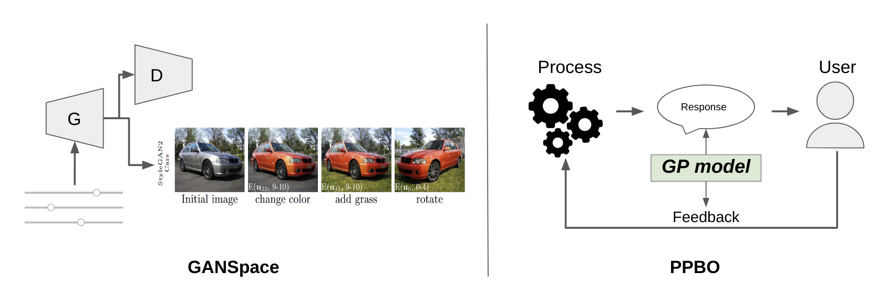
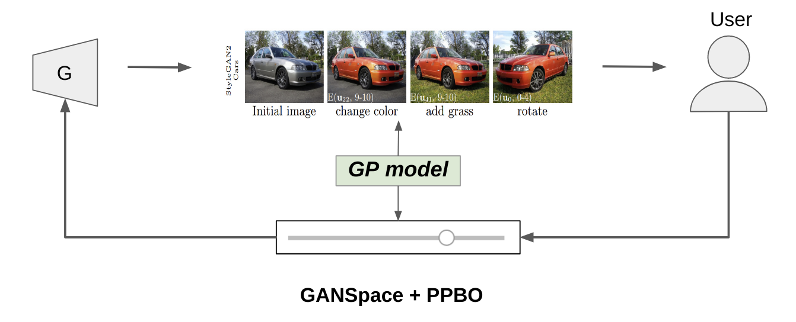

# GANspace + PPBO project

### Current Problems

Too tiny modifications after turning off adaptive initialization.

Solutions:

1) Decrease number of components and boundaries
2) If (1) step doesn't work, use `GPModel.optimize_theta()`
3) Try to change `max_iter_fMAP_estimation` parameter to 5000 (default is 500) in PPBO settings.

## Idea

Probabilistic Interactive User Model for Interactive AI

Based on 2 projects:
- GANSpace
- Projective Preferential Bayesian Optimization (PPBO)

Idea Formulation: Adjust image generation model (GAN) to follow user’s preferences using Bayesian Optimization.

## Set Up

1. Install anaconda or miniconda
2. Create environment: `conda create -n ganppbo python=3.7`
3. Activate environment: `conda activate ganppbo`
4. Install dependencies: `conda env update -f environment.yml --prune`
5. Activate widget extension: `jupyter nbextension enable --py widgetsnbextension`

## Original project info

Currently, the code of both projects is commited to this repository. 
Later ganspace is going to be transformed into submodule. 
PPBO will stay a part of this code since it was changed.

Original repositories:
- https://github.com/harskish/ganspace
- https://github.com/AaltoPML/PPBO

Origial README files:
- [GANSpace README file](ganspace/README.md)
- [PPBO README file](PPBO/README.md)

Additional info:
- [Changes performed to PPBO project](md_files_and_imgs/ppbo_changes.md)

